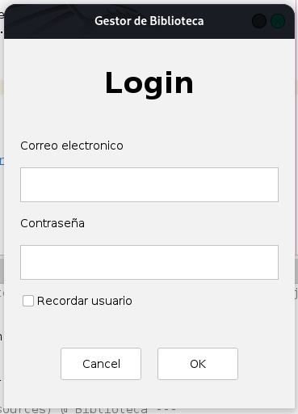
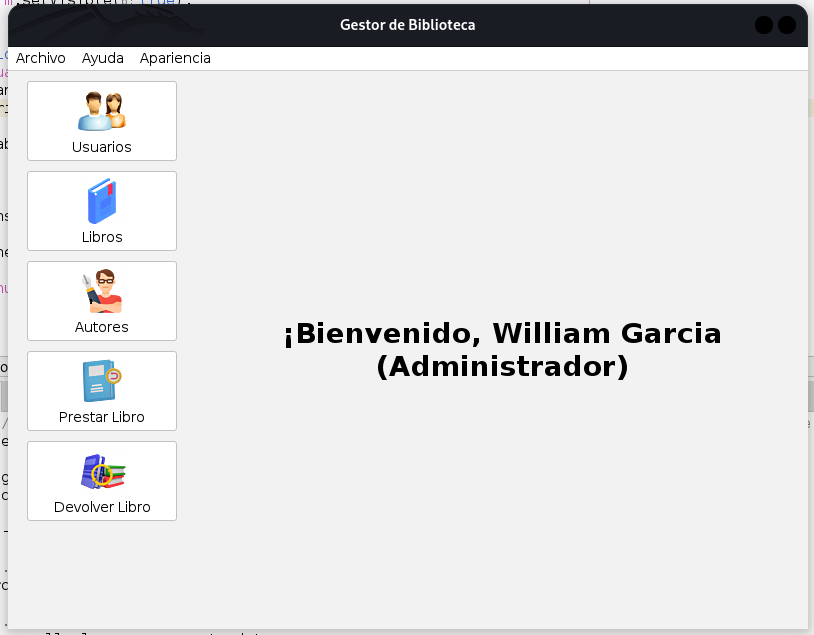
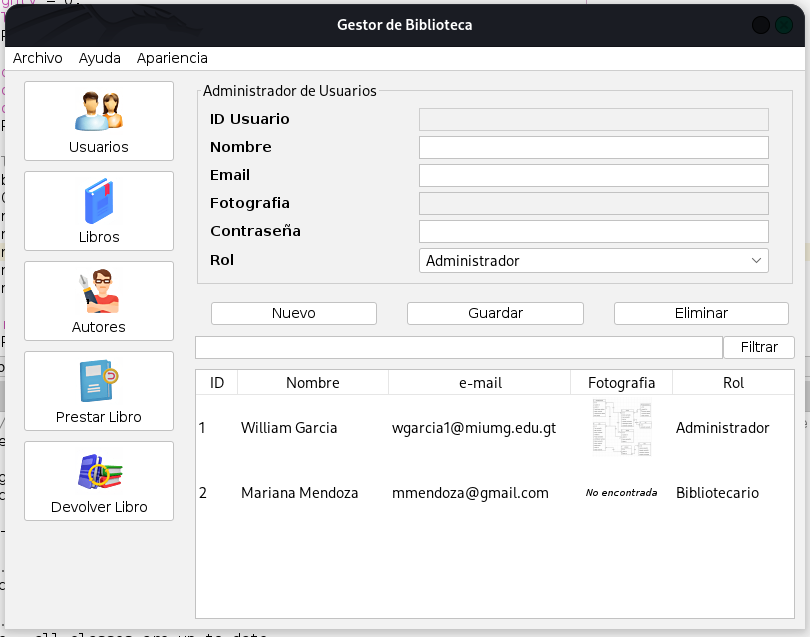
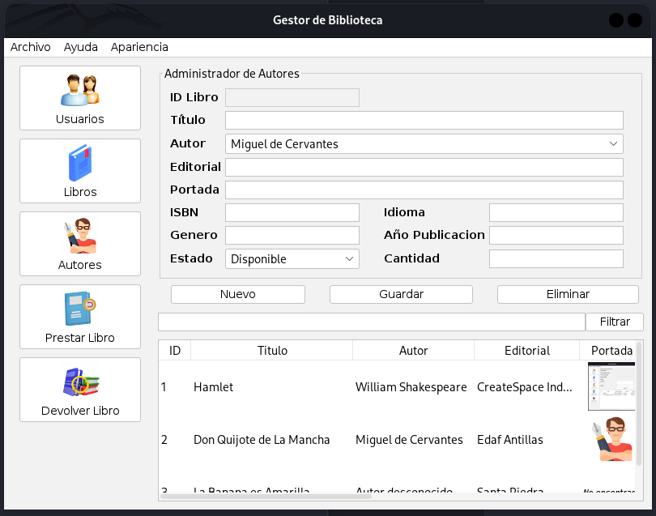
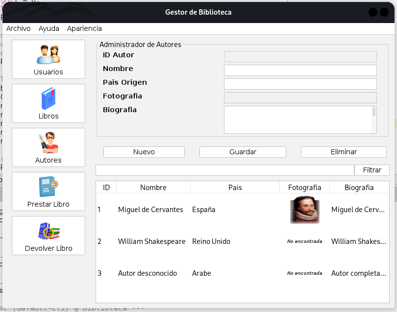
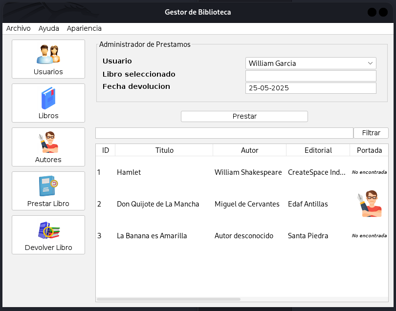

# 📚 Sistema de Biblioteca - Java Swing MVC

Este es un sistema completo de gestión de biblioteca desarrollado en Java utilizando el patrón de diseño MVC.  
Incluye módulos para autenticación, gestión de usuarios, libros, autores, préstamos y devoluciones.

---

## ✨ Características

- 🔐 Login seguro con hash y salt.
- ✅ Recordar usuario.
- 👥 Gestión de usuarios con roles.
- 📘 Gestión de libros y autores.
- 📖 Registro de préstamos y devoluciones.
- 📁 Persistencia de datos en archivos JSON.
- 🎨 Interfaz gráfica con Java Swing.

---

## 📷 Capturas de pantalla

### Login



### Menú principal



### Formulario de usuarios



### Formulario de libros



### Formulario de autores



### Formulario de prestar Libro



### Formulario de devolver libro


> Las imágenes deben colocarse en la carpeta: `capturas/`

---

## 🧩 Requisitos

- Java 21 o superior
- IDE recomendado: NetBeans 
- Maven (opcional, pero recomendado)
- Biblioteca JSON: **Gson** (`com.google.code.gson:gson`)
- Biblioteca Flatlaf: **Flatlaf** (`com.formdev`)

---

## 🚀 Instalación y ejecución

1. **Descargar el archivo ZIP del proyecto**
   
   - Obtén el archivo `Biblioteca.zip`.
   - Descomprime el archivo en cualquier carpeta de tu computadora.

2. **Importar el proyecto en NetBeans**
   
   - Abre **NetBeans**.
   - Ve a **Archivo → Abrir proyecto...**
   - Navega hasta la carpeta descomprimida y selecciona el proyecto.
   - Espera a que NetBeans lo cargue completamente.

3. **Agregar dependencia de Gson**
   
   Si estás **usando Maven**, asegúrate de tener esta dependencia en tu archivo `pom.xml`:
   
   ```xml
   <dependencies>  
       <dependency>
           <groupId>com.google.code.gson</groupId>
           <artifactId>gson</artifactId>
           <version>2.10.1</version>
       </dependency>
       <dependency>
           <groupId>com.formdev</groupId>
           <artifactId>flatlaf</artifactId>
           <version>2.6</version>
       </dependency>
   </dependencies>
   ```

> NetBeans descargará automáticamente las librerías al guardar el archivo.

4. **Ejecutar el proyecto**
   
   - Dentro del árbol de archivos, busca la clase `Biblioteca.java`
   
   - Haz clic derecho sobre el archivo y selecciona **"Run File"** o presiona `Shift + F6`.

## ## 🗃 Estructura del proyecto

```bash
/data/
    └── autores.json
    └── libros.json
    └── prestamos.json
    └── recordar_usuario.json
    └── resenas.json
    └── roles.json
    └── usuarios.json
/src/
    └── /main/
        └── /java/
            └── /controladores/
                └── AutorController.java
                └── DevolverController.java
                └── LibroController.java
                └── LoginController.java
                └── MenuController.java
                └── PrestarController.java
                └── UsuarioController.java
            └── /datasources/
                └── AutorData.java
                └── LibroData.java
                └── PrestamoData.java
                └── RecordarUsuarioData.java
                └── ResenaData.java
                └── RolData.java
                └── UsuarioData.java
            └── /modelos/
                └── Autor.java
                └── HistorialPrestamo.java
                └── Libro.java
                └── LibroAutor.java
                └── RecordarUsuario.java
                └── Resena.java
                └── Rol.java
                └── Sesion.java
                └── Usuario.java
            └── /util/
                └── FileInitializer.java
                └── ImageRenderer.java
                └── LocalDateAdapater.java
                └── LocalDateTimeAdapter.java
                └── LookAndFeel.java
                └── Password.java
                └── StarRatingRenderer.java
                └── SwingControls.java
                └── TabOrderPolicy.java
                └── YearAdapter.java
            └── /vistas/
                └── AutorForm.java
                └── DevolucionesForm.java
                └── LibroForm.java
                └── LoginForm.java
                └── MenuForm.java
                └── PrestamosForm.java
                └── UsuarioForm.java
            └── Biblioteca.java
```

## 🧑‍💻 Autores

- William Garcia

- Julio Lemus

- Oscar Gonzalez

- Bryan Mundo

## 📄 Licencia

Este proyecto es de uso académico y puede ser modificado con fines educativos. No se permite su redistribución comercial sin autorización previa.
